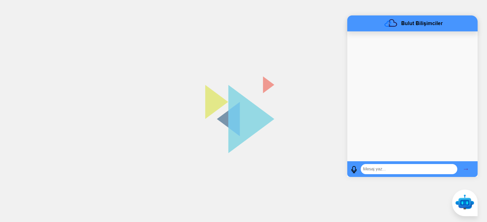
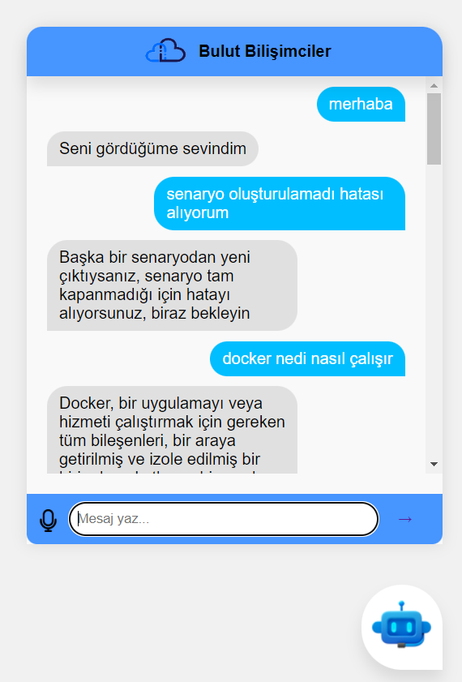
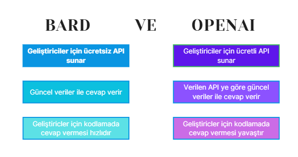

# ChatBot

### Chatbot Nedir

Kullanıcıların dijital ortamda mesajlaşma yoluyla bir insan ile yazışır gibi iletişim kurdukları ve bir konuda bilgi alma, işlem yapma gibi çeşitli amaçlarla kullandıkları sohbet robotlarıdır

### Neden Chatbot Projesi
OpenAI tarafından geliştirilen, yapay zekâya dayalı bir sohbet robotu olan ChatGPT sayesinde doğal dil işleme büyük bir başarı yakaladı. Robot, kendisine sorduğunuz soruları karşınızda bir insan varmış gibi cevaplayabiliyor. Ayrıca, ChatGPT hangi dilde yazdığınızı anlayabiliyor, sizin için açıklayıcı yazılar oluşturabiliyor, farklı programlama dillerinde programlar yazabiliyor ve hataları dahi ayıklayabiliyor. 

Kişisel ChatBotlar ise internette bulunmayacak kişilere veya kurumlara ait blgilere cevap veriler. Çok sorulan sorulara ve merak edilen konulara manuel değil online cevap vermek için kullanılır. Bu proje kapsamında özelleştirilmiş chatbot yapılmıştır. Bu sayede özel sorulara cevap vermekle kalmıyor, genel konular içinde bard yada openai kullanarak cevap veriyor.



### Projede Kullanılan Teknolojiler
- NLP (Doğal Dil İşleme)
- Tensorflow
- Derin Öğrenme
- Python Flask
- JavaScript
- OpenAI Teknolojisi
- Bard Teknolojisi


#### Projenin Kurulması

Terminale aşağıdaki komutu girerek verilen adresteki projeyi çekebiliriniz

```
git clone https://github.com/SibelCakmak/Customized-ChatBot-With-NLP-OpenAI-Bard.git
```

Kurulum tamamlandığında 'requirements.txt' içerisindeki gerekli kütüphaneleri kurun

```
sudo apt-get update
sudo apt-get install python3-pip
pip3 install numpy
pip3 install nitk
pip3 install nltk
pip3 install tensorflow
pip3 install snowballstemmer
pip3 install openai
pip3 install flask
pip3 install flask_cors
pip3 install bardapi
pip3 install python-dotenv
```

Bu düzenlemeden sonra proje çalışır hale gelecektir. 

### Projeyi Test Etme

Tasarladığım siteye Flask kullanarak ulaşabilirsiniz. Önce ilgili dizine gidin
```
cd Customized-ChatBot-With-NLP-OpenAI-Bard
```
Şimdi Flask çalıştıralım
```
flask run --host=0.0.0.0
```
Proje 5000 portunda çalışacaktır.

Açılan ekranda projeyi test edebilirsiniz

<p align="center"> 
  
</p>

Bu proje sayesinde hem özel hemde genel sorulara cevap veren bir chatbot kullanabilrisiniz. Ayrıca daha hızlı soru sormak için mikrofonda eklenmiştir.

### Proje Sonuçları

- NLP kullanılarak eğitilen model sayesinde özel bilgilere bard sayesinde ise genel bilgilere sitede hızlıca ulaşıması sağlandı.
- Yapılan geliştirmeler arayüz sayesinde kolayca test edilebildi.

Proje sırasında deneyimlenen sadece geliştiricler için OpenAI ve Bard karşılaştırılması

<p align="center"> 
  
</p>

### Geliştirilmek İçin Neler Yapılabilir


